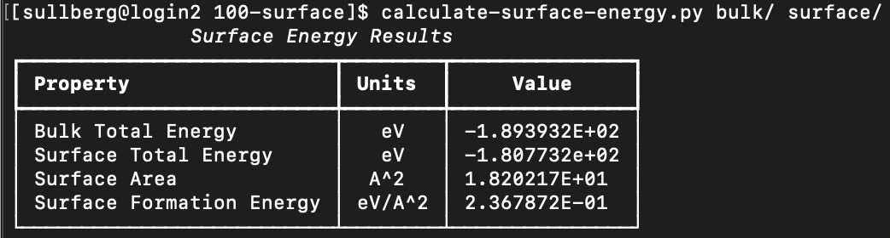

# vasp-scripts
Scripts to automate common operations with the Vienna Ab-initio Simulation Package.

## Installation

The collection can be downloaded from PyPI under the package name `phillpot-vasp-scripts`.

```bash
$ pip install phillpot-vasp-scripts
```

## Available Scripts

__[calculate-surface-energy.py](scripts/calculate-surface-energy.py)__ - Calculate surface formation energy from a bulk system and a system with an exposed surface.

##### Positional Arguments:
* `bulk` - Path to the bulk system's calculation directory.
* `surface` - Path to the surface exposed system's calculation directory.



__[run-kpoints-convergence.py](scripts/run-kpoints-convergence.py)__ - Sets up a k-points convergence study from the input files in the current directory.

##### Positional Arguments:
* `min` - Minimum grid density.
* `max` - Maximum grid density.
* `n` - Number of density values to test.

##### Optional Arguments:
* `--style` - The kpoint style (gamma, monkhorst...). Defaults to 'gamma'.
* `--jobcmd` - The command used to submit the job script. Defaults to 'sbatch' (SLURM).
* `--jobfile` - The filename of the job submission script. Defaults to 'runjob.slurm'.