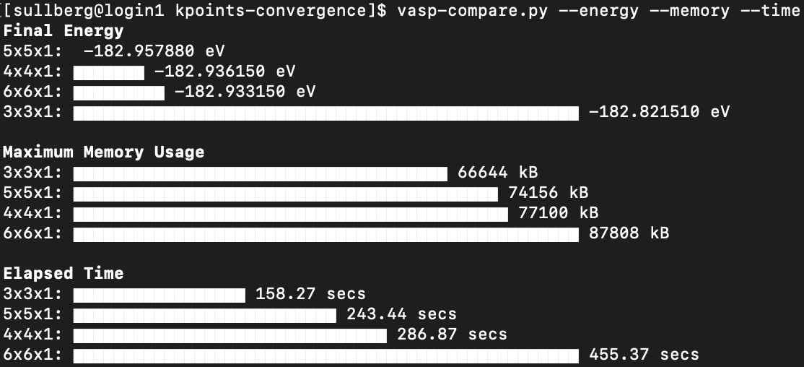
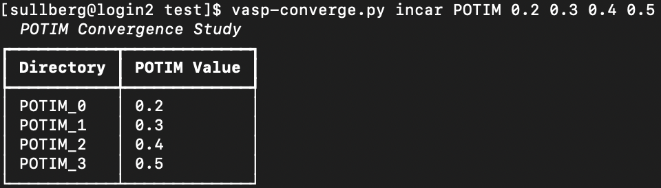
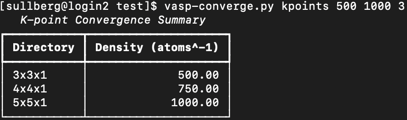
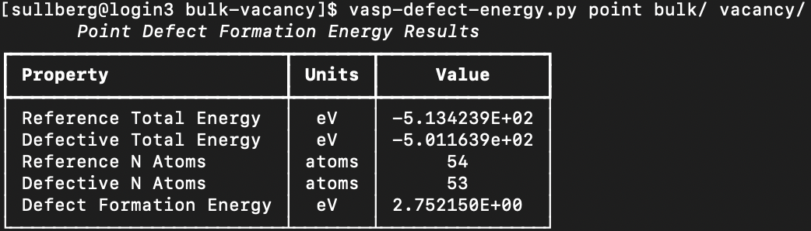
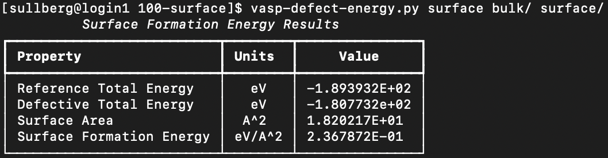

# vasp-scripts
Scripts to automate common operations with the Vienna Ab-initio Simulation Package.

## Installation

The collection can be downloaded from [PyPI](https://pypi.org/project/phillpot-vasp-scripts/) under the package name `phillpot-vasp-scripts`.

```bash
$ pip install phillpot-vasp-scripts
```
Assuming your `pip` installation is configured correctly, the scripts will be immediately available through your `PATH` environment variable.

## Available Scripts

__[vasp-compare.py](scripts/vasp-compare.py)__ - Compares the results of a set of calculations in the current directory.

##### Optional Arguments:
* `--energy` - Enables comparison of final energy.
* `--memory` - Enables comparison of maximum memory usage.
* `--time` - Enables comparison of elapsed time.
* `--ignore` - Directory names to exclude from consideration




__[vasp-converge.py](scripts/vasp-converge.py)__ - Sets up a convergence test from input files in the current directory.

##### Subcommands:
* `incar` - Signals an INCAR tag convergence test.

    ###### Positional Arguments:
    * `tag` - INCAR tag name.
    * `values` - Tag values to test.



* `kpoints` - Signals a k-point convergence test.
    
    ###### Positional Arguments:
    * `min` - Minimum grid density.
    * `max` - Maximum grid density.
    * `n` - Number of density values to test.

    ###### Optional Arguments:
    * `--mode` - Grid construction mode (gamma, monkhorst...). Defaults to 'gamma'.



##### Optional Arguments:
* `--jobcmd` - The command used to submit the job script. Defaults to 'sbatch' or environment variable `JOBCMD`.
* `--jobfile` - The filename of the job submission script. Defaults to 'runjob.slurm' or environment variable `JOBFILE`.

__[vasp-defect-energy.py](scripts/vasp-defect-energy.py)__ - Calculates defect formation energy between a reference system and a defective system.

##### Subcommands:
* `point` - Signals a point defect energy calculation.

    ###### Positional Arguments:
    * `perfect` - Path to the perfect system's calculation directory.
    * `defect` - Path to the defective system's calculation directory.
    * `ground` - Path to the defect specie's ground state calculation directory.



* `surface` - Signals a surface formation energy calculation.

    ###### Positional Arguments:
    * `perfect` - Path to the perfect system's calculation directory.
    * `defect` - Path to the defective system's calculation directory.
    * `plane` - Specifies which plane to interpret as surface. Defaults to 'xy'. Valid options are 'xy', 'xz', and 'yz'.




__[vasp-restart.py](scripts/vasp-defect-energy.py)__ - Restarts a calculation after a timeout or failure.

##### Optional Arguments:
* `--jobcmd` - The command used to submit the job script. Defaults to 'sbatch' or environment variable `JOBCMD`.
* `--jobfile` - The filename of the job submission script. Defaults to 'runjob.slurm' or environment variable `JOBFILE`.